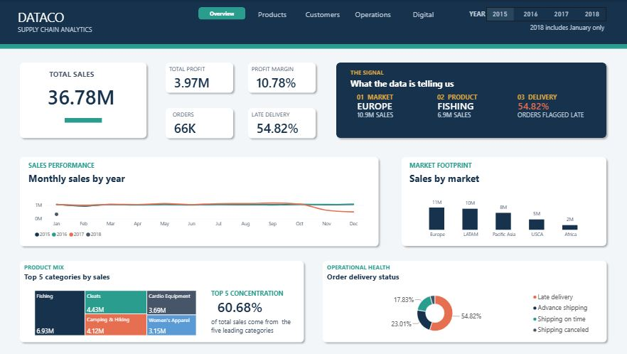
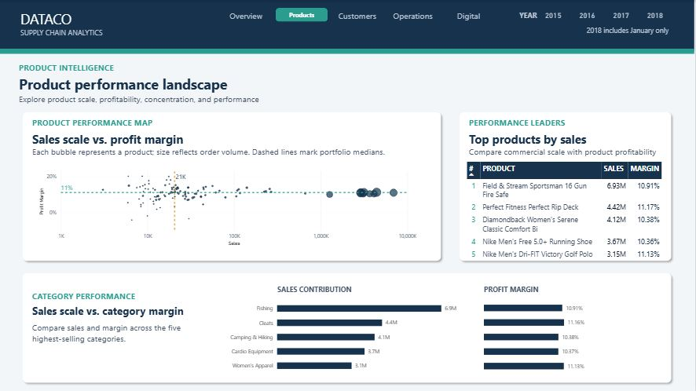
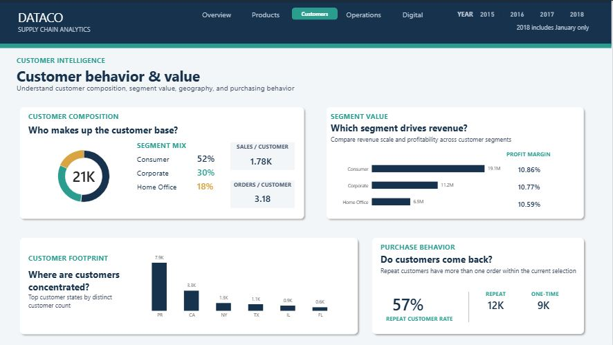
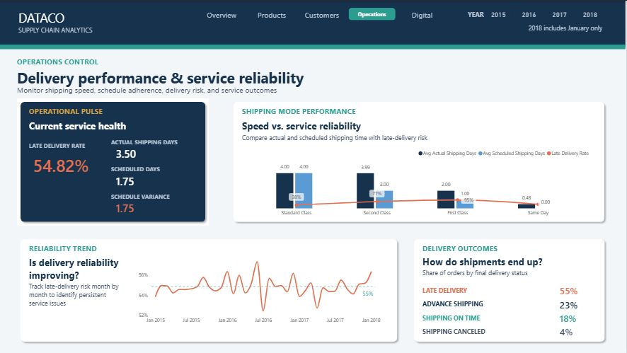
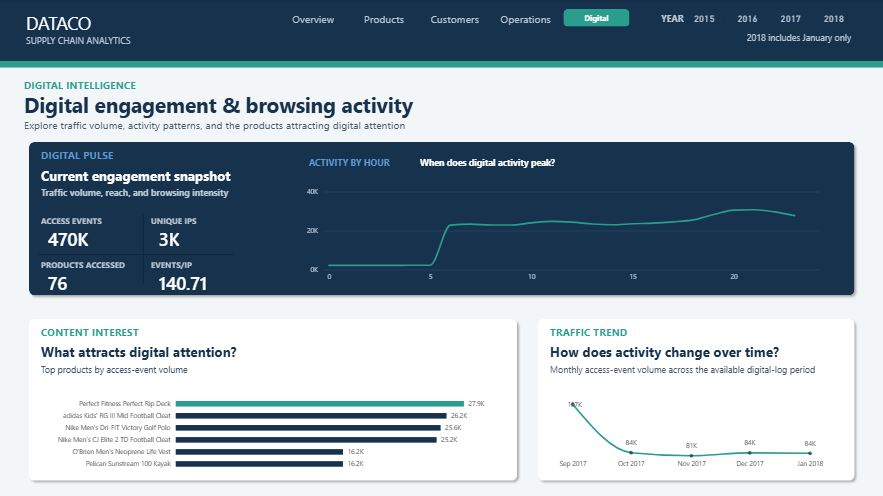

# DataCo Supply Chain Analytics | End-to-End Data Analysis

An end-to-end supply chain analytics project using **PostgreSQL, Python, and Power BI** to explore commercial performance, customer behavior, product profitability, delivery reliability, and digital engagement.

The project follows a complete analytical workflow from raw-data exploration and cleaning through statistical analysis, data modeling, DAX development, and an interactive five-page Power BI report.

---

## Power BI Report Preview



---

## Project Objectives

The project was designed to answer business questions across several areas of the DataCo supply chain:

- How are sales, profit, orders, and customers performing?
- Which markets, products, and categories generate the greatest commercial value?
- Does higher product sales volume translate into stronger profitability?
- How do customer segments differ in scale, value, geography, and repeat purchasing behavior?
- Where are the largest delivery and shipping-performance issues?
- How does digital product interest behave across products, time, and hours of the day?
- Does digital engagement align with transactional sales performance?

---

## Tools & Technologies

- **PostgreSQL** — data exploration, cleaning, transformation, and business analysis
- **Python** — Pandas, Matplotlib, Seaborn, SciPy
- **Power BI** — data modeling, DAX, interactive dashboards, and visual storytelling
- **DBeaver** — PostgreSQL development environment
- **Jupyter Notebook** — Python analysis

---

## Dataset

The project uses the **DataCo Smart Supply Chain for Big Data Analysis** dataset from Kaggle.

**Source:**  
https://www.kaggle.com/datasets/shashwatwork/dataco-smart-supply-chain-for-big-data-analysis

The source includes:

- `DataCoSupplyChainDataset.csv` — transactional, customer, product, order, and shipping data
- `tokenized_access_logs.csv` — digital product-access activity
- `DescriptionDataCoSupplyChain.csv` — field descriptions

The two raw datasets are not stored in this repository because of their file size. The data dictionary is included under [`data/`](data/).

---

## Analytical Workflow

### 1. Data Exploration

Initial SQL exploration was used to understand:

- dataset grain
- duplicate order IDs
- data types
- missing values
- customer and product structure
- delivery outcomes
- markets and geography
- discount behavior
- shipping modes

The transactional dataset contains **180,519 rows**, while only **65,752 distinct Order IDs** exist because a single order can contain multiple products.

### 2. Data Cleaning

A separate clean layer was created so that the raw tables remained unchanged.

Cleaning included:

- converting order and shipping dates from text to proper date types
- investigating null and empty fields
- validating suspicious values and outliers
- removing fields that were empty, constant, sensitive, or irrelevant to analysis
- flattening array-like access-log fields
- validating product coverage between digital-access and transaction data

The final transaction analysis table retained **44 analytical columns from the original 53**.

### 3. SQL Analysis

SQL was used for deeper business analysis, including:

- month and year performance
- year-over-year comparisons
- market and regional performance
- category and product rankings
- shipping-mode reliability
- late-delivery analysis
- customer-segment performance
- digital access vs. transactional performance

Advanced SQL techniques included:

- CTEs
- `LAG()`
- `ROW_NUMBER()`
- window functions
- conditional aggregation
- partitioned rankings
- multi-table joins

### 4. Python Analysis

Python was used to investigate distributions and relationships that were better suited to statistical and visual analysis.

Key areas included:

- profit distribution and outliers
- late-delivery risk vs. profitability
- shipment variance
- product sales vs. profit margin
- discount-rate behavior
- customer sales concentration
- statistical hypothesis testing
- correlation analysis

### 5. Power BI

The final Power BI model was built using a star-schema approach with reusable DAX measures and interactive filtering.

The report contains five analytical pages:

1. **Overview**
2. **Products**
3. **Customers**
4. **Operations**
5. **Digital**

---

# Key Findings

## Commercial Performance

- Europe generated the highest overall sales among the major markets.
- Fishing was the largest category by sales.
- Product sales volume showed virtually no relationship with profit margin, meaning high-volume products were not necessarily more profitable.
- Customer sales were broadly distributed rather than being heavily concentrated among a small group of customers.

## Customer Behavior

- The Consumer segment represented the largest share of customers and revenue.
- Profit margins were very similar across Consumer, Corporate, and Home Office segments, suggesting that Consumer leadership was driven primarily by scale.
- Repeat customers represented approximately **57%** of the customer base.

## Operations & Delivery

- Late delivery was the largest delivery-status group.
- Overall late-delivery risk was approximately **55%**.
- Actual shipping time averaged roughly **3.5 days**, compared with approximately **1.75 scheduled days**.
- Shipping reliability varied substantially by shipping mode.
- Late-risk and non-late-risk orders showed only small differences in profitability despite substantial differences in shipping performance.

## Digital Engagement

- The access-log dataset recorded approximately **470K access events** across roughly **3K unique IP addresses**.
- Digital activity was very low overnight, increased sharply in the early morning, and reached its highest levels during the evening.
- Online product attention did not consistently align with transactional sales performance.
- During the **September 2017–January 2018 comparison period**, only **36 of 76 accessed products** also generated sales, while **40 accessed products had no matching sales activity**.

---

# Power BI Report

## 1. Executive Overview

A high-level view of sales, profit, customers, orders, markets, categories, and delivery performance.


---

## 2. Product Intelligence

Explores product scale, profitability, leading products, and category-level commercial performance.



---

## 3. Customer Intelligence

Analyzes customer composition, segment value, geographic concentration, and repeat purchasing behavior.



---

## 4. Operations Control

Monitors late-delivery risk, shipping-mode performance, reliability trends, and delivery outcomes.



---

## 5. Digital Intelligence

Explores digital traffic volume, hourly activity patterns, product interest, and access-event trends.



---

## Repository Structure

```text
dataco-supply-chain-analytics/
│
├── data/
│   ├── DescriptionDataCoSupplyChain.csv
│   └── README.md
│
├── images/
│   ├── 1_Overview.JPG
│   ├── 2_Products.JPG
│   ├── 3_Customers.JPG
│   ├── 4_Operations.JPG
│   ├── 5_Digital.JPG
│   └── README.md
│
├── powerbi/
│   ├── DataCo_Supply_Chain_Analysis.pbix
│   └── README.md
│
├── python/
│   ├── DataCo_Analysis.ipynb
│   └── README.md
│
├── sql/
│   ├── 1_transactions_eda.sql
│   ├── 2_transactions_cleaning.sql
│   ├── 3_token_access_eda_cleaning.sql
│   ├── 4_analysis.sql
│   └── README.md
│
└── README.md
